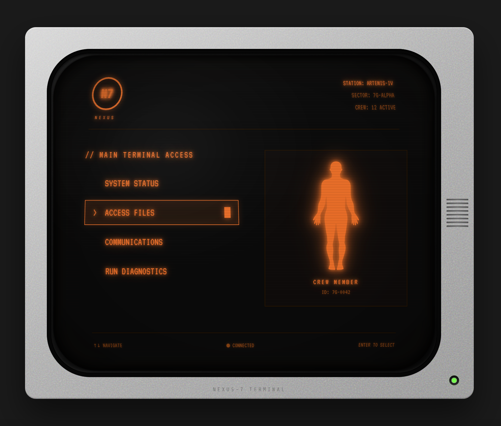
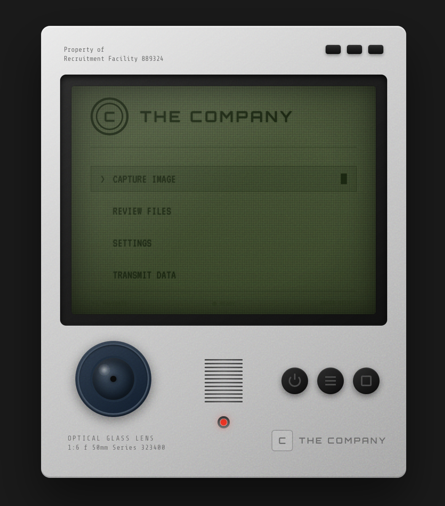
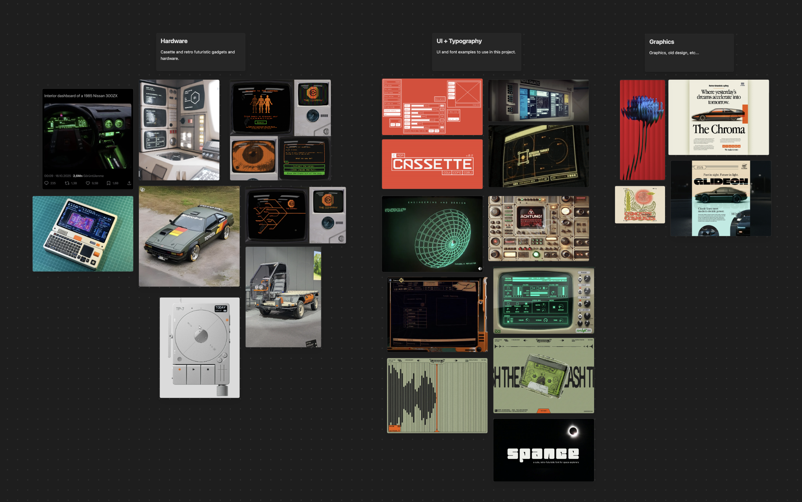
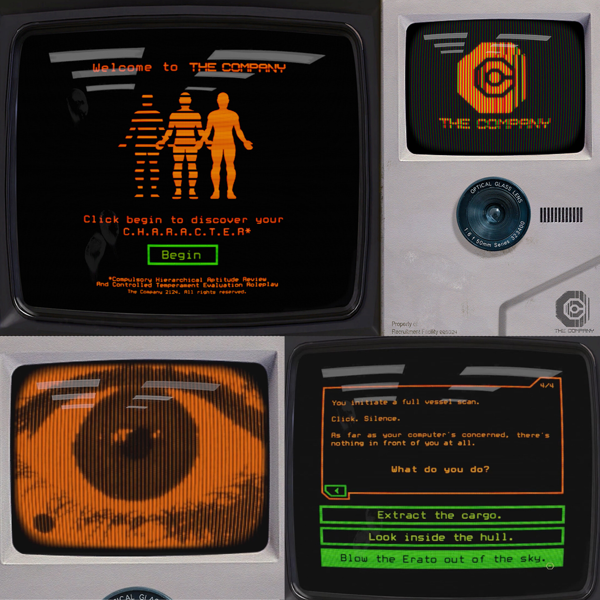
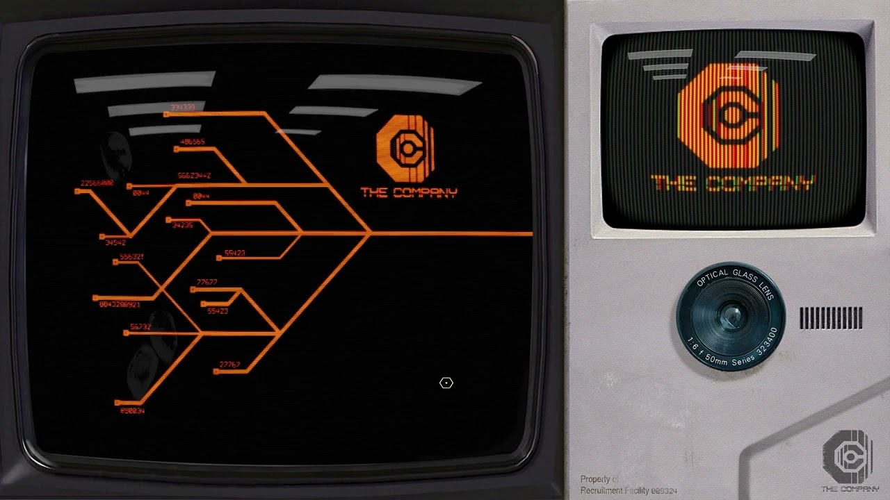
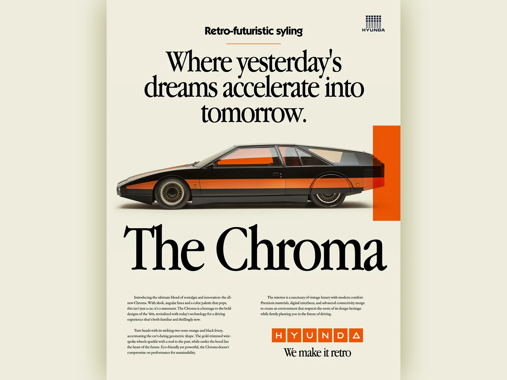

# Retro-Futuristic UI Gallery
 
A collection of React components that recreate the aesthetic of 1970s-80s retro-futuristic devices — the "Cassette Futurism" style seen in Alien (1979), Blade Runner, and games like Signalis.

<table>
<tr>
<td width="57%">

<p align="center"><strong>CRT Terminal</strong><br/>Amber phosphor display with curved screen</p>
</td>
<td width="43%">

<p align="center"><strong>LCD Surveillance Device</strong><br/>Greenish LCD screen with camera lens</p>
</td>
</tr>
</table>

## Features

### CRT Terminal

- **Authentic CRT screen curvature** with elliptical border radius and layered glass effects
- **Phosphor glow** on all text via layered text-shadows (amber/orange palette)
- **Scanline overlay** using repeating CSS gradients
- **Screen vignette** darkening toward edges to simulate curved glass
- **Specular highlight** in upper-left corner mimicking light on glass
- **Random glitch effect** with hue rotation and position jitter
- **Boot sequence animation** with typewriter-style text reveal
- **Interactive menu** navigable via keyboard (↑↓ + Enter) or mouse
- **Blinking cursor** and status indicators
- **Hardware details**: beige monitor bezel, vent slots, green power LED

### LCD Surveillance Device

- **Greenish LCD screen** with authentic old LCD appearance
- **Pixel grid effect** simulating LCD matrix
- **Camera lens** with realistic glass reflections and focal distance markings
- **Control buttons** (power, menu, select) with 3D pressed effect
- **Red LED indicator** below speaker grille
- **Speaker grille** with metallic slots
- **Grayish plastic housing** with realistic texture
- **"THE COMPANY" branding** matching the retro-futuristic aesthetic

## Design Moodboard



## Design References

The components draw inspiration from these reference images:

| Reference | Description |
|-----------|-------------|
|  | Nathan David Jones' retrofuturistic UI concept — note the amber-on-black palette, chunky bezels, and interactive text prompts |
|  | Branching narrative interface with "THE COMPANY" branding — demonstrates the phosphor glow and scanline effects |
|  | Retro-futuristic car advertisement showing the broader aesthetic context — angular geometry, orange/black palette, vintage-meets-future vibe |

## Installation

This is now a complete React + TypeScript application using Vite with React Router for navigation.

```bash
# Install dependencies
npm install

# Start development server
npm run dev

# Build for production
npm run build

# Preview production build
npm run preview
```

The development server will start at `http://localhost:5173` (or another port if 5173 is busy).

## Usage

The application includes a gallery interface where you can navigate between different retro gadgets. Components are located at:

```
src/components/CRTTerminal.tsx
src/components/CRTTerminal.css
src/components/LCDGadget.tsx
src/components/LCDGadget.css
```

To use individual components in your own project, copy the component files and import:

```tsx
import CRTTerminal from './components/CRTTerminal';
import LCDGadget from './components/LCDGadget';

function App() {
  return (
    <>
      <CRTTerminal scale={0.8} />
      <LCDGadget scale={0.6} />
    </>
  );
}
```

Both components accept an optional `scale` prop to adjust their size.

## Dependencies

- React 18+
- React Router DOM 6+
- TypeScript 5+
- Vite 5+ (build tool)
- Google Fonts: VT323, Share Tech Mono, Orbitron (loaded via CSS import)

## Customization

### CRT Terminal Color Palette

The amber phosphor color is defined throughout the component. Key values:

```css
/* Primary amber */
#ff6a00

/* Dimmed amber for secondary text */
#994400

/* Border/divider color */
#331a00

/* Glow effect */
rgba(255, 106, 0, 0.8)  /* strong */
rgba(255, 106, 0, 0.3)  /* subtle */
```

To switch to green phosphor (like classic IBM terminals), replace with:

```css
/* Primary green */
#00ff41

/* Dimmed green */
#00802b

/* Border color */
#003311
```

### LCD Device Color Palette

The greenish LCD uses:

```css
/* LCD background */
#4a5a3a to #354525 (gradient)

/* LCD text */
#1a2a10

/* Device housing */
#e8e8e8 to #a0a0a0 (gradient)
```

### Screen Size

Modify these values in the respective CSS files:

**CRT Terminal** (`.crt-screen`):
```css
width: 700px;
height: 580px;
```

**LCD Device** (`.lcd-screen`):
```css
width: 400px;
height: 300px;
```

### Curvature Intensity

Adjust the border-radius in `.crt-screen`:

```css
/* More curved (fishbowl effect) */
border-radius: 80px;

/* Less curved (flatter) */
border-radius: 30px;
```

## Technical Details

### CRT Terminal

The CRT effect is achieved through multiple layered elements:

1. **Base screen** (`.crt-screen`) — dark background with curved border-radius
2. **Scanlines** (`::before` pseudo-element) — repeating 3px gradient stripes
3. **Vignette** (`::after` pseudo-element) — radial gradient darkening edges
4. **Glass overlay** (`.crt-glass`) — additional edge darkening for depth
5. **Specular highlight** (`.crt-bulge`) — light reflection on curved glass
6. **Edge shadow** (`.edge-shadow`) — inset shadows reinforcing curve illusion
7. **Reflection** (`.reflection`) — subtle top highlight

The content sits inside a 3D-transformed container (`.screen-warp`) with perspective to add subtle depth.

### LCD Device

The LCD effect uses:

1. **Pixel grid** (`::before` pseudo-element) — repeating 2-3px grid pattern
2. **Scanlines** (`.lcd-scanlines`) — subtle horizontal lines
3. **Glass reflection** (`.lcd-glass`) — diagonal gradient for glass effect
4. **Vignette** (`::after` pseudo-element) — edge darkening
5. **Camera lens** — Multiple layered elements with radial gradients for realistic glass appearance

## Browser Support

Tested on modern browsers (Chrome, Firefox, Safari, Edge). The CSS effects use standard properties with no vendor prefixes required.

## License

MIT — do whatever you want with it.

## Credits

Design inspired by the work of [Nathan David Jones](https://www.artstation.com/nathandjones) and the broader cassette futurism aesthetic movement.